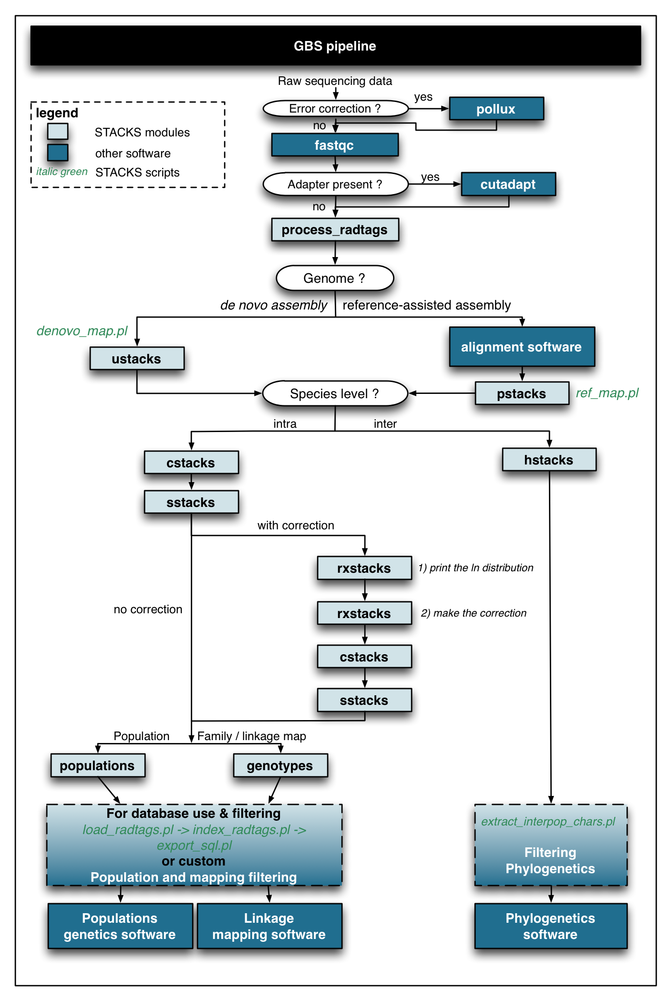

[](https://travis-ci.org/thierrygosselin/radiator) [](https://ci.appveyor.com/project/thierrygosselin/radiator) [](http://cran.r-project.org/package=radiator) [](http://www.repostatus.org/#active) [](https://zenodo.org/badge/latestdoi/14548/thierrygosselin/radiator)

[](commits/master) [](/commits/master)

------------------------------------------------------------------------

radiator: an R package for RADseq Data Exploration, Manipulation and Visualization
==================================================================================

This is the development page of the **radiator**, if you want to help, see [contributions section](https://github.com/thierrygosselin/radiator#contributions)

Most genomic analysis look for patterns and trends with various statistics. Bias, noise and outliers can have bounded influence on estimators and interfere with polymorphism discovery. Avoid bad data exploration and control the impact of filters on your downstream genetic analysis. Use radiator to: import, explore, manipulate, visualize, filter, impute and export your GBS/RADseq data.

**radiator** was born from **stackr**. All RADseq filters and visualization related code has been moved out of **stackr** and into a new package, **radiator**. This makes **stackr** and **radiator** simpler, and will make it easier to release fixes for bugs that only affect these packages.

Installation
------------

To try out the dev version of **radiator**, copy/paste the code below:

``` r
if (!require("devtools")) install.packages("devtools") # to install
devtools::install_github("thierrygosselin/radiator")
library(radiator)
```

<table style="width:100%;">
<colgroup>
<col width="26%" />
<col width="73%" />
</colgroup>
<thead>
<tr class="header">
<th align="left">Caracteristics</th>
<th align="left">Description</th>
</tr>
</thead>
<tbody>
<tr class="odd">
<td align="left"><strong>Import</strong></td>
<td align="left">List of the 11 supported genomic file formats in <code>tidy_genomic_format</code> and <code>genomic_converter</code>:<br> <a href="https://samtools.github.io/hts-specs/">VCF, SNPs and haplotypes</a> (Danecek et al., 2011)<br><a href="http://pngu.mgh.harvard.edu/~purcell/plink/data.shtml#tr">PLINK tped/tfam</a> (Purcell et al., 2007)<br><a href="https://github.com/thibautjombart/adegenet">genind</a> (Jombart et al., 2010; Jombart and Ahmed, 2011)<br> <a href="https://github.com/thibautjombart/adegenet">genlight</a> (Jombart et al., 2010; Jombart and Ahmed, 2011), also in <code>tidy_genlight</code><br><a href="https://github.com/EricArcher/strataG">strataG gtypes</a> (Archer et al., 2016)<br><a href="http://genepop.curtin.edu.au">Genepop</a> (Raymond and Rousset, 1995; Rousset, 2008), also in <code>tidy_genepop</code><br><a href="http://catchenlab.life.illinois.edu/stacks/">STACKS haplotype file</a> (Catchen et al., 2011, 2013)<br> <a href="https://github.com/jgx65/hierfstat">hierfstat</a> (Goudet, 2005), also in <code>tidy_fstat</code><br>Dataframes of genotypes in wide or long/tidy format, also in <code>tidy_wide</code></td>
</tr>
<tr class="even">
<td align="left"><strong>Output</strong></td>
<td align="left">16 genomic data formats can be exported out of <strong>radiator</strong> using <code>genomic_converter</code> or these separate modules:<br><code>write_vcf</code>: <a href="https://samtools.github.io/hts-specs/">VCF</a> (Danecek et al., 2011)<br><code>write_plink</code>: <a href="http://pngu.mgh.harvard.edu/~purcell/plink/data.shtml#tr">PLINK tped/tfam</a> (Purcell et al., 2007)<br><code>write_genind</code>: <a href="https://github.com/thibautjombart/adegenet">adegenet genind and genlight</a> (Jombart et al., 2010; Jombart and Ahmed, 2011)<br><code>write_genlight</code>: <a href="https://github.com/thibautjombart/adegenet">genlight</a> (Jombart et al., 2010; Jombart and Ahmed, 2011)<br><code>write_gtypes</code>: <a href="https://github.com/EricArcher/strataG">strataG gtypes</a> (Archer et al. 2016)<br><code>write_colony</code>: <a href="https://www.zsl.org/science/software/colony">COLONY</a> (Jones and Wang, 2010; Wang, 2012)<br><code>write_genepop</code>: <a href="http://genepop.curtin.edu.au">Genepop</a> (Raymond and Rousset, 1995; Rousset, 2008)<br><a href="http://catchenlab.life.illinois.edu/stacks/">STACKS haplotype file</a> (Catchen et al., 2011, 2013)<br><code>write_betadiv</code>: <a href="http://adn.biol.umontreal.ca/~numericalecology/Rcode/">betadiv</a> (Lamy, 2015)<br> <code>vcf2dadi</code>: <a href="http://gutengroup.mcb.arizona.edu/software/">δaδi</a> (Gutenkunst et al., 2009)<br> <code>write_structure</code>: <a href="http://pritchardlab.stanford.edu/structure.html">structure</a> (Pritchard et al., 2000)<br> <code>write_arlequin</code>: <a href="http://cmpg.unibe.ch/software/arlequin35/">Arlequin</a> (Excoffier et al. 2005)<br> <code>write_hierfstat</code>: <a href="https://github.com/jgx65/hierfstat">hierfstat</a> (Goudet, 2005)<br> <code>write_snprelate</code>: <a href="https://github.com/zhengxwen/SNPRelate">SNPRelate</a> (Zheng et al. 2012)<br>Dataframes of genotypes in wide or long/tidy format</td>
</tr>
<tr class="odd">
<td align="left"><strong>Conversion function</strong></td>
<td align="left"><code>genomic_converter</code> import/export genomic formats mentioned above. The function is also integrated with usefull filters, blacklist and whitelist.</td>
</tr>
<tr class="even">
<td align="left"><strong>Outliers detection</strong></td>
<td align="left"><code>detect_duplicate_genomes</code>: Detect and remove duplicate individuals from your dataset <br><code>detect_mixed_genomes</code>: Detect and remove potentially mixed individuals<br><code>summary_haplotype</code> and <code>filter_snp_number</code>: Discard of outlier markers with <em>de novo</em> assembly artifact (e.g. markers with an extreme number of SNP per haplotype or with irregular number of alleles)</td>
</tr>
<tr class="odd">
<td align="left"><strong>Pattern of missingness</strong></td>
<td align="left">With the help of <code>grur::missing_visualization</code>: Visualize patterns of missing data. Find patterns associated with different variables of your study (lanes, chips, sequencers, populations, sample sites, reads/samples, homozygosity, etc)</td>
</tr>
<tr class="even">
<td align="left"><strong>Filters</strong></td>
<td align="left">Alleles, genotypes, markers, individuals and populations can be filtered and/or selected in several ways:<br><br><code>filter_coverage</code>: Discard markers based on read depth (coverage) of alleles and genotypes<br><code>filter_genotype_likelihood</code>: Discard markers based on genotype likelihood<br><code>filter_individual</code>: Discard markers based on proportion of genotyped individuals<br><code>filter_population</code>: Discard markers based on proportion of genotyped populations<br><code>filter_het</code>: Discard markers based on the observed heterozygosity (Het obs)<br><code>filter_fis</code>: Discard markers based on the inbreeding coefficient (Fis)<br><code>filter_hw</code>: Discard markers based on the Hardy-Weinberg Equilibrium expectations (HWE)<br><code>filter_maf</code>: Discard markers based on local or global (overall) minor allele frequency</td>
</tr>
<tr class="odd">
<td align="left"><strong>Imputations</strong></td>
<td align="left">The imputation engine or <strong>grur</strong> inside <strong>radiator. </strong>Map-independent** imputations of missing genotypes.<br>Using <strong>Random Forests</strong> (on-the-fly-imputations or predictive modeling), <strong>Extreme Gradient Tree Boosting</strong> and Strawman imputations (~ max/mean/mode: the most frequently observed, non-missing genotypes is used).<br> Imputations can be conducted <strong>overall samples</strong> or <strong>by populations</strong>.<br><br>Imputations are integrated in several <strong>radiator</strong> functions. For the separate module, see <a href="https://github.com/thierrygosselin/grur">grur</a></td>
</tr>
<tr class="even">
<td align="left"><strong><a href="http://ggplot2.org">ggplot2</a>-based plotting</strong></td>
<td align="left">Visualize distribution of important metric and statistics and create publication-ready figures</td>
</tr>
<tr class="odd">
<td align="left"><strong>Parallel</strong></td>
<td align="left">Codes designed and optimized for fast computations running imputations, iterations, etc. in parallel. Works with all OS: Linux, Mac and now PC!</td>
</tr>
</tbody>
</table>

[More in radiator workflow below](https://github.com/thierrygosselin/radiator#radiator-workflow)

Prerequisite - Suggestions - Troubleshooting
--------------------------------------------

-   **Parallel computing**: Follow the steps in this [vignette](https://github.com/thierrygosselin/radiator/blob/master/vignettes/vignette_imputations_parallel.Rmd) to install [data.table](https://github.com/Rdatatable/data.table) and [XGBoost](https://github.com/dmlc/xgboost) packages (e.g. to do imputations in parallel).
-   **Installation problem:** see this [vignette](https://github.com/thierrygosselin/radiator/blob/master/vignettes/vignette_installation_problems.Rmd)
-   **Windows users**: Install [Rtools](https://cran.r-project.org/bin/windows/Rtools/).
-   For a better experience in **radiator** and in R in general, I recommend using [RStudio](https://www.rstudio.com/products/rstudio/download/). The R GUI is unstable with functions using parallel ([more info](https://stat.ethz.ch/R-manual/R-devel/library/parallel/html/mclapply.html)).

Vignettes, R Notebooks and examples
-----------------------------------

**Vignettes (in development, check periodically for updates):**

-   Vignettes with real data for example in the form of R Notebooks take too much space to be included in package, without CRAN complaining. Consequently, vignettes are gradually being excluded from the package and distributed separately, follow the links below.
-   [installation problems](https://github.com/thierrygosselin/radiator/blob/master/vignettes/vignette_installation_problems.Rmd)
-   [parallel computing during imputations](https://github.com/thierrygosselin/radiator/blob/master/vignettes/vignette_imputations_parallel.Rmd)
-   [vcf2dadi](https://github.com/thierrygosselin/radiator/blob/master/vignettes/vignette_vcf2dadi.Rmd)
-   [haplo2genind](https://github.com/thierrygosselin/radiator/blob/master/vignettes/vignette_haplo2genind.Rmd)

**R Notebooks:**

-   Missing data visualization and analysis [(html vignette)](https://www.dropbox.com/s/4zf032g6yjatj0a/vignette_missing_data_analysis.nb.html?dl=0) and [(Rmd)](https://www.dropbox.com/s/5fxw2h9w1l1j391/vignette_missing_data_analysis.Rmd?dl=0)

Citation:
---------

To get the citation, inside R:

``` r
citation("radiator")
```

New features
------------

Change log, version, new features and bug history lives in the [NEWS.md file](https://github.com/thierrygosselin/radiator/blob/master/NEWS.md)

**v.0.0.1 2017-06-18**

-   First commit

For previous news: [NEWS.md file](https://github.com/thierrygosselin/radiator/blob/master/NEWS.md)

Roadmap of future developments:
-------------------------------

-   Updated filters: more efficient, interactive and visualization included: *in progress*.
-   Workflow tutorial that links functions and points to specific vignettes to further explore some problems: *in progress*
-   Integration of several functions with [STACKS](http://catchenlab.life.illinois.edu/stacks/) and [DArT](http://www.diversityarrays.com) database *in progress*.
-   Use Shiny and ggvis (when subplots and/or facets becomes available for ggvis).
-   Until publication **radiator** will change rapidly, stay updated with releases and contribute with bug reports.
-   Suggestions ?

Contributions:
--------------

This package has been developed in the open, and it wouldn’t be nearly as good without your contributions. There are a number of ways you can help me make this package even better:

-   If you don’t understand something, please let me know.
-   Your feedback on what is confusing or hard to understand is valuable.
-   If you spot a typo, feel free to edit the underlying page and send a pull request.

New to pull request on github ? The process is very easy:

-   Click the edit this page on the sidebar.
-   Make the changes using github’s in-page editor and save.
-   Submit a pull request and include a brief description of your changes.
-   “Fixing typos” is perfectly adequate.

GBS workflow
------------

The **radiator** package fits currently at the end of the GBS workflow. Below, a flow chart using [STACKS](http://catchenlab.life.illinois.edu/stacks/) and other software. 

radiator workflow
-----------------

Currently under construction. Come back soon!

**Table 1: Quality control and filtering RAD/GBS data**

<table style="width:86%;">
<colgroup>
<col width="8%" />
<col width="9%" />
<col width="9%" />
<col width="9%" />
<col width="9%" />
<col width="9%" />
<col width="9%" />
<col width="9%" />
<col width="9%" />
</colgroup>
<thead>
<tr class="header">
<th align="left">Parameters</th>
<th align="center">Libraries &amp; Seq.Lanes</th>
<th align="center">Alleles</th>
<th align="center">Genotypes</th>
<th align="center">Individuals</th>
<th align="center">Markers</th>
<th align="center">Sampling sites</th>
<th align="center">Populations</th>
<th align="center">Globally</th>
</tr>
</thead>
<tbody>
<tr class="odd">
<td align="left">Quality</td>
<td align="center">x</td>
<td align="center"></td>
<td align="center"></td>
<td align="center">x</td>
<td align="center"></td>
<td align="center"></td>
<td align="center"></td>
<td align="center"></td>
</tr>
<tr class="even">
<td align="left">Assembly and genotyping</td>
<td align="center">x</td>
<td align="center"></td>
<td align="center"></td>
<td align="center"></td>
<td align="center"></td>
<td align="center"></td>
<td align="center"></td>
<td align="center"></td>
</tr>
<tr class="odd">
<td align="left">Outliers</td>
<td align="center"></td>
<td align="center">x</td>
<td align="center">x</td>
<td align="center">x</td>
<td align="center">x</td>
<td align="center"></td>
<td align="center"></td>
<td align="center"></td>
</tr>
<tr class="even">
<td align="left">Missingness</td>
<td align="center">x</td>
<td align="center">x</td>
<td align="center">x</td>
<td align="center">x</td>
<td align="center">x</td>
<td align="center">x</td>
<td align="center">x</td>
<td align="center">x</td>
</tr>
<tr class="odd">
<td align="left">Coverage</td>
<td align="center"></td>
<td align="center">x</td>
<td align="center">x</td>
<td align="center"></td>
<td align="center">x</td>
<td align="center"></td>
<td align="center"></td>
<td align="center"></td>
</tr>
<tr class="even">
<td align="left">Genotype Likelihood</td>
<td align="center"></td>
<td align="center"></td>
<td align="center">x</td>
<td align="center"></td>
<td align="center"></td>
<td align="center"></td>
<td align="center"></td>
<td align="center"></td>
</tr>
<tr class="odd">
<td align="left">Prop. Genotyped</td>
<td align="center"></td>
<td align="center"></td>
<td align="center"></td>
<td align="center">x</td>
<td align="center">x</td>
<td align="center">x</td>
<td align="center">x</td>
<td align="center">x</td>
</tr>
<tr class="even">
<td align="left">HET &amp; FIS &amp; HWE</td>
<td align="center"></td>
<td align="center"></td>
<td align="center"></td>
<td align="center">x</td>
<td align="center">x</td>
<td align="center"></td>
<td align="center">x</td>
<td align="center"></td>
</tr>
<tr class="odd">
<td align="left">MAF</td>
<td align="center"></td>
<td align="center"></td>
<td align="center"></td>
<td align="center"></td>
<td align="center">x</td>
<td align="center">x</td>
<td align="center">x</td>
<td align="center">x</td>
</tr>
<tr class="even">
<td align="left">Missingness</td>
<td align="center">x</td>
<td align="center">x</td>
<td align="center">x</td>
<td align="center">x</td>
<td align="center">x</td>
<td align="center">x</td>
<td align="center">x</td>
<td align="center">x</td>
</tr>
</tbody>
</table>

**Step 1 Quality** Ask yourself these questions:

-   DNA quality, libraries quality, sequencing lanes quality ?
-   Please stop thinking in terms of quantity (e.g. millions of reads returned), and start thinking about actual quality of your new data.
-   Use quality metrics inside available software (e.g. fastqc)

**Step 2 *de novo* assembly and genotyping**

-   This is conducted outside radiator
-   Integrated software pipelines include: [STACKS](http://catchenlab.life.illinois.edu/stacks/), [pyRAD](http://dereneaton.com/software/), [dDocent](https://ddocent.wordpress.com), [AftrRAD](http://u.osu.edu/sovic.1/downloads/). If you want to develop your own pipeline, there are a multitude of approaches, good luck.

**Step 3 Outliers**

-   Remove replicates (I hope you have some).
-   Remove *de novo* assembly artifact, by creating blacklist of genotypes or whitelist of markers:
    -   individuals with more than 2 alleles (use `summary_haplotypes`)
    -   outlier markers with extreme number of SNP/read or haplotype (use `filter_snp_number`)
-   Remove potential duplicated samples that went off your radar, try `detect_duplicate_genomes`.
-   Highlight outliers individual's heterozygosity that might represent mixed samples with `detect_mixed_individuals`.
-   The metric you're using: a *de novo* artefact or a reliable signal of biological polymorphism?
-   Should the statistic you are interested in be consistent throughout the read ?
-   Will you consider haplotype or snp level statistics?
-   The consistensies of SNPs statistics among haplotype can be throughly tested by using `snp.ld` argument in several radiator functions.
-   Any other outliers with different individual's or markers metrics (reads/sample, etc) ?

**Step 4 Pattern of missingness**

-   Use `grur::missing_visualization` with/without your new blacklists (e.g. of genotypes, individuals) and with/without whitelist of markers to examine patterns of missingness in you dataset before more extensive filtering (there is a vignette for this step)
-   The trick here is to use the `strata` argument to find patterns associated with different variables of your study (lanes, chips, sequencers, populations, sample sites, reads/samples, etc).
-   Do you see a trend between your missing pattern and reads/samples ? Heterozygosity?
-   Do you need more sequencing? Do you have to re-run some lanes?

**Step 5-6 Coverage and Genotype Likelihood**

-   Coverage is an individual metric. With most software you'll find allele and genotype coverage info.
-   Genotype likelihood is usually a metric based on coverage of the different genotypes found in all of your data.
-   Good allele coverage is required for reliable genotypes.
-   Reliable genotypes is required for reliable downstream summary statistics.
-   Explore filtering options in `filter_coverage` and `filter_genotype_likelihood`.

**Step 7 Prop. Genotyped**

-   Do you have enough individuals in each sampling sites (`filter_individual`) and enough putative populations (`filter_population`) for each markers ?
-   Use blacklist of individuals with different thresholds.
-   Keep different whitelist of markers.
-   Use `common.markers` argument inside most of radiator functions to test the impact of vetting loci based on shared markers.
-   Use imputation methods provided by radiator (inside `tidy_genomic_data` or `genomic_converter`, as a separate module: `radiator_imputations_module`) to assess the impact of lowering or increasing threshold that impact missing data.

**Step 8 HET, Fis, HWE**

-   Overall and/or per populations hwe, heterozygosity and Fis statistics can highlight: *de novo* assembly problems (oversplitting/undermerging), genotyping problems or biological problems.
-   These filters allows to test rapidly if departure from realistic expectations are a problem for downstream analysis ?
-   Choose your threshold wisely and test impact on pipeline.
-   Use `filter_het`, `filter_fis`, `filter_hwe` and look again at the individual's heterozygosity (`detect_mixed_individuals`) for outliers.

**Step 9 MAF**

-   Remove artifactual and uninformative markers.
-   Use MAF arguments inside several of radiator functions to tailor MAF to your analysis tolerance to minor allelel frequencies.
-   There is also a separate filter in radiator: `filter_maf`

**Step 10 Pattern of missingness, again**

-   Use `grur::missing_visualization` with your new blacklists (e.g. of genotypes, individuals) and with your whitelist of markers to examine patterns of missingness in your dataset after filtering (there is a vignette for this step)
-   The trick here is to use the `strata` argument to find patterns associated with different variables of your study (lanes, chips, sequencers, populations, sample sites, reads/samples, etc).
-   Do you see a trend between your missing pattern and reads/samples ? Heterozygosity?
